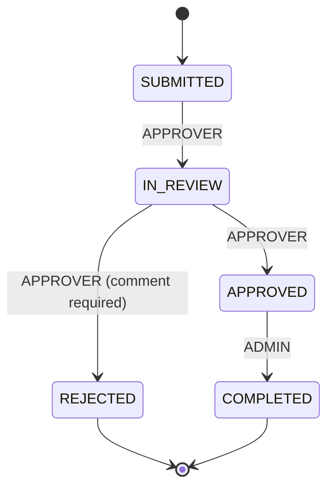



Live demo: http://184.195.61.226/health

# OpsFlow

A small REST API for managing internal operational requests (e.g. access requests, purchase requests) through an approval workflow, built with Express and TypeScript.

## Stack

- Node.js + Express
- TypeScript (strict mode)
- Jest + Supertest for unit and API tests
- In-memory data store (no database - see "Possible extensions")

## Setup

```bash
git clone https://github.com/aryansingh2112005/opsflow.git
cd opsflow
npm install
npm run dev
```

The server starts on http://localhost:3000. Check it's running:

```bash
curl http://localhost:3000/health
# {"status":"ok"}
```

## Authentication

There's no real auth system - instead, every request must include two headers identifying the caller:

| Header | Description |
|---|---|
| x-user-id | Any string identifying the user |
| x-role | One of REQUESTER, APPROVER, ADMIN |

Missing or invalid headers return 401.

## Roles and permissions

| Role | Can do |
|---|---|
| REQUESTER | Create requests, view/list their own requests |
| APPROVER | View/list all requests, move SUBMITTED to IN_REVIEW, IN_REVIEW to APPROVED/REJECTED |
| ADMIN | View/list all requests, move APPROVED to COMPLETED |

## State machine



Rules enforced by src/workflow.ts:
- Only the transitions above are allowed; anything else returns 409.
- Only the listed role may make each transition; the wrong role returns 403.
- Rejecting a request requires a non-empty comment; otherwise returns 400.
- Every transition is recorded in the request's history array with from, to, by, at, and an optional comment.

## Endpoints

| Method | Path | Role | Description |
|---|---|---|---|
| GET | /health | none | Health check |
| POST | /requests | REQUESTER | Create a request |
| GET | /requests | any | List requests (requesters see only their own) |
| GET | /requests/:id | any | View one request (requesters only their own) |
| PATCH | /requests/:id/status | varies | Change status |

### Create a request

```bash
curl -X POST http://localhost:3000/requests -H "x-user-id: aryan" -H "x-role: REQUESTER" -H "Content-Type: application/json" -d "{\"title\":\"VPN access\",\"description\":\"Need VPN\",\"type\":\"ACCESS\",\"priority\":\"HIGH\"}"
```

### Move a request forward

```bash
curl -X PATCH http://localhost:3000/requests/<id>/status -H "x-user-id: priya" -H "x-role: APPROVER" -H "Content-Type: application/json" -d "{\"status\":\"IN_REVIEW\"}"
```

### Reject with a comment

```bash
curl -X PATCH http://localhost:3000/requests/<id>/status -H "x-user-id: priya" -H "x-role: APPROVER" -H "Content-Type: application/json" -d "{\"status\":\"REJECTED\",\"comment\":\"Not needed\"}"
```

## Testing

```bash
npm test
```

- src/workflow.test.ts - unit tests for the state machine in isolation (no HTTP, no storage).
- src/app.test.ts - API tests via Supertest covering auth, validation, permissions, and the full request lifecycle.

## Project structure

src/
types.ts # shared types
auth.ts # header-based auth middleware
store.ts # in-memory data store
workflow.ts # state machine logic (pure functions)
routes.ts # /requests endpoints
app.ts # Express app assembly
index.ts # server entrypoint


## Known limitations / possible extensions

- Data is in-memory and resets on restart - swapping store.ts for SQLite/Postgres would be the natural next step, since it's the only file that touches storage.
- No pagination on GET /requests.
- No rate limiting or real authentication (JWT, sessions, etc.).

